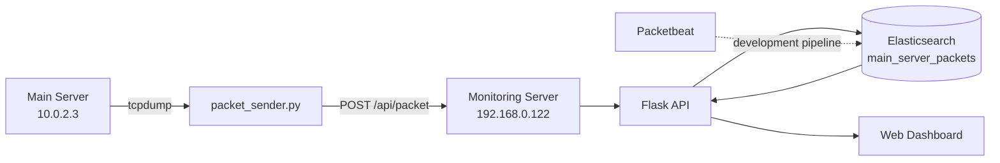

# Real-Time Network Monitoring System

**실시간 네트워크 트래픽 수집·저장·분석 및 Web Dashboard 시스템**

Ubuntu/Linux 환경에서 네트워크 패킷을 실시간으로 수집하고 Elasticsearch에 저장한 뒤, Flask 기반 Web Dashboard에서 패킷 수·트래픽 추이·위험 이벤트·주요 IP·상세 로그를 확인하도록 구성한 프로젝트입니다.

> 이 저장소는 2025.04–2025.06 프로젝트 진행 당시 기록을 바탕으로 소스와 서버 설정을 다시 정리한 **복원/포트폴리오용 저장소**입니다. 당시 최종 파일 원문이 남아 있지 않은 일부 코드는 기록된 구조와 동작을 기준으로 재구성했습니다.

---

## Project Goals

- Linux 서버에서 네트워크 패킷 실시간 수집
- 수집 데이터를 Elasticsearch에 저장 및 검색
- Flask API로 패킷 데이터 제공
- Web Dashboard에서 네트워크 상태 시각화
- Gunicorn + Nginx + systemd 기반 서비스 운영

---

## Technology

`Ubuntu/Linux` `Python` `Flask` `Elasticsearch` `Packetbeat` `tcpdump` `Gunicorn` `Nginx` `systemd`

---

## Architecture



프로젝트 개발 과정에서는 **Packetbeat → Elasticsearch → Flask → Dashboard** 구조를 사용했고, 최종 구성에서는 메인 서버의 `tcpdump` 데이터를 `packet_sender.py`가 모니터링 서버의 `/api/packet`으로 전송하는 구조도 함께 사용했습니다.

---

## Server Configuration

| Role | Address | Main Components |
|---|---|---|
| Main / monitored server | `10.0.2.3` | Apache2, tcpdump, packet_sender.py |
| Main server access/proxy address | `192.168.0.65` | Browser / external access |
| Monitoring server | `192.168.0.122` | Flask, Elasticsearch, Gunicorn, Nginx |

Elasticsearch index: `main_server_packets`

Dashboard: `http://192.168.0.122`

---

## Main Data Flow

```text
Network Packet
   ↓
tcpdump / Packetbeat
   ↓
packet_sender.py
   ↓
POST /api/packet
   ↓
Flask
   ↓
Elasticsearch (main_server_packets)
   ↓
Dashboard
```

---

## Dashboard

대시보드에서 다음 정보를 확인하도록 구성했습니다.

- **Total Packets** — 누적 패킷 수
- **Traffic Trend** — 시간대별 실시간 트래픽 추이
- **Danger Events** — 위험 이벤트 수
- **Threat / Active IPs** — 주요 통신 IP
- **Packet Logs** — 출발지/목적지/프로토콜/포트/길이/원문 로그

---

## API

### `POST /api/packet`

메인 서버에서 캡처한 패킷 정보를 모니터링 서버로 전송합니다.

```json
{
  "timestamp": "2025-06-09T12:00:00+00:00",
  "src_ip": "10.0.2.3",
  "src_port": 80,
  "dst_ip": "192.168.0.10",
  "dst_port": 52111,
  "protocol": "TCP",
  "length": 128,
  "raw": "tcpdump raw line"
}
```

### `POST /api/reset`

저장된 `main_server_packets` 인덱스 데이터를 초기화합니다.

---

## Project Structure

```text
.
├── app.py
├── packet_sender.py
├── requirements.txt
├── templates/
│   └── dashboard.html
├── static/
│   └── style.css
├── packetbeat/
│   └── packetbeat.yml
├── systemd/
│   ├── packetwatcher.service
│   └── packet_sender.service
├── nginx/
│   └── packetwatcher.conf
└── docs/
    └── architecture.md
```

---

## Run Monitoring Server

```bash
python3 -m venv venv
source venv/bin/activate
pip install -r requirements.txt
python app.py
```

Elasticsearch가 `http://localhost:9200`에서 실행 중이어야 합니다.

---

## Run Packet Sender

메인 서버에서:

```bash
sudo apt install tcpdump python3-requests
sudo python3 packet_sender.py
```

기본 전송 주소는 `http://192.168.0.122/api/packet`입니다.

---

## My Work

- Ubuntu/Linux 서버 구축
- Packetbeat 기반 네트워크 데이터 수집
- tcpdump 기반 실시간 Packet Capture 구성
- Python `packet_sender.py`를 이용한 서버 간 패킷 전달
- Elasticsearch 데이터 저장 및 검색 구조 구성
- Flask REST API 개발
- Backend와 Web Dashboard 데이터 연결
- Nginx/Gunicorn/systemd 서비스 구성 및 트러블슈팅

---

## Portfolio Summary

> Linux 서버에서 발생하는 네트워크 패킷을 실시간으로 수집하고 Elasticsearch에 저장한 뒤, Flask API와 Web Dashboard를 통해 트래픽·위험 이벤트·IP·패킷 로그를 모니터링할 수 있도록 구축한 프로젝트입니다.
